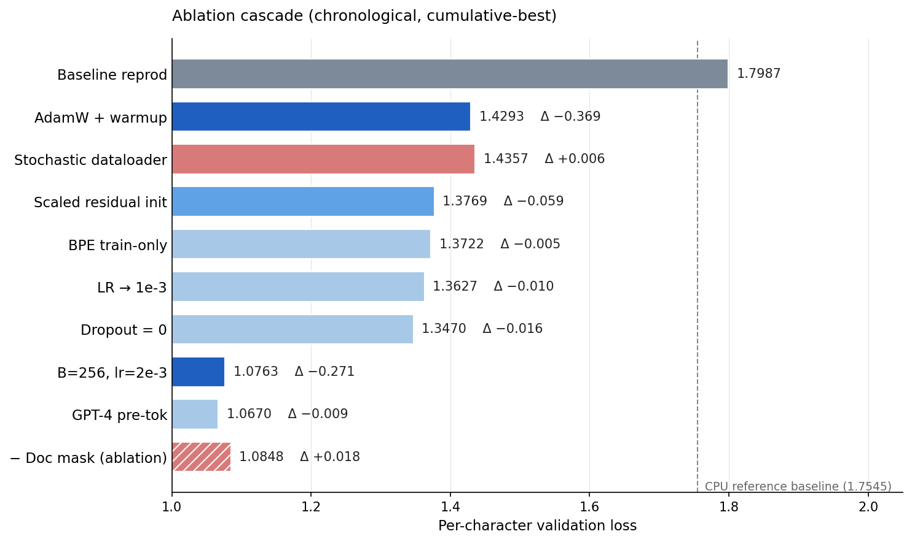
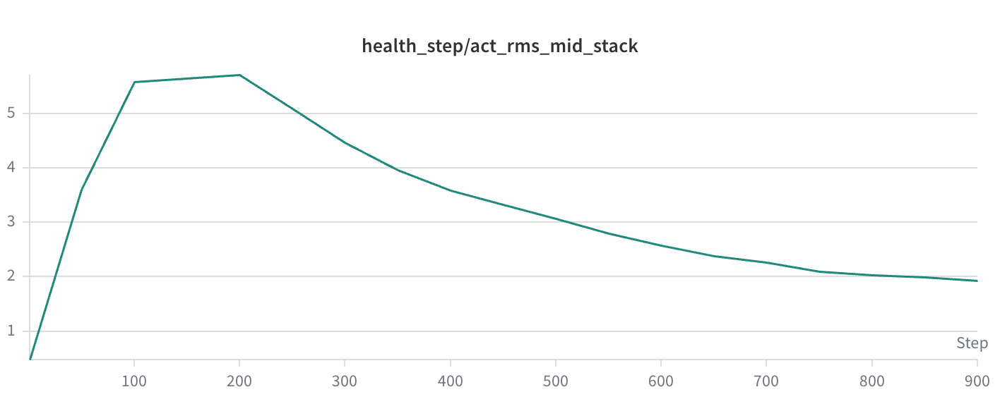

# Mainrun: Reducing Validation Loss from 1.7545 to 1.0670

## TL;DR

Starting from a baseline per-character validation loss of **1.7545**, a sequence of targeted interventions brought the final per-character loss to **1.0670**, a **~39%** reduction. Two interventions accounted for ~87% of the gain: swapping SGD for AdamW with warmup (−0.370), and co-tuning batch size and learning rate (−0.270). Optimization, not capacity, was the dominant bottleneck — a model-size sweep across (n_layer, n_head, d_model) configurations was effectively flat. Diagnostic telemetry, built before any ablations, paid for itself twice: residual-stream RMS readings flagged warmup-time overshoot and pointed at a scaled residual init fix, and the per-group update-to-parameter ratio surfaced what looked like a stability concern but turned out to be a learning-efficiency opportunity that the obvious rule-of-thumb response would have missed.

*Figure 1: Per-character validation loss across cascade milestones, anchored at the GPU reproduction of the reference baseline (1.7987). Solid bars are the cumulative-best chronology; the hatched bar at the bottom is the document-level attention masking control ablation — same final config with `use_doc_mask=False`, included for comparison and discussed in §What moved the needle.*

## Approach

The first move was diagnostic, not corrective. The baseline was making slow but monotonic progress on validation loss — no overfitting U-curve, but plain SGD against a transformer, no warmup, no adaptive moments, and a still-falling curve at the end of training. The shape suggested an optimization regime with substantial headroom rather than a fundamentally broken model. Before changing anything, the priority was instrumenting the run.

That meant: per-step gradient norms, per-parameter-group update-to-parameter ratios, RMS taps at three points in the residual stream (post-embed, mid-stack, pre-head), per-position validation loss, and per-token validation loss alongside the canonical per-character metric. A `DualLogger` made structlog the canonical store — every numeric metric was emitted there once. wandb was a derived view: visualization layer for the analysis pass, plus a transport layer that ferried the structlog file and the best-checkpoint artifact off the GPU box without bloating the git repo with run outputs. One write site, no drift.

With diagnostics in place, every intervention was framed as a pre-registered prediction: what the relevant telemetry should do if the change worked, and what it should do if it didn't. The discipline mattered more than any single prediction — articulating a mechanism before running compute sharpened decisions about what to bundle versus what to isolate.

A vast.ai GPU box (~2 min per 7-epoch run vs ~80 min on the canonical CPU dev container) made ablation-by-ablation iteration cheap rather than prohibitive, with `task fetch-run` pulling the structlog files and best-checkpoint artifact back from wandb to local for analysis and submission.

## What moved the needle

The major interventions, in chronological order. All val-loss values are cumulative-best per-character loss, anchored against a GPU reproduction of the reference baseline at 1.7987 (see methodological note on the GPU/CPU reproducibility gap).

**Optimizer swap (SGD → AdamW + linear warmup + cosine decay).** *1.7987 → 1.4293, Δ −0.370.* The largest single jump, on its own ~50% of the total reduction. Plain SGD at the original learning rate was descending too slowly to use the available step budget. Switching to AdamW (β₁=0.9, β₂=0.95, weight_decay=0.1 on 2D tensors only, ε=1e-8, peak lr=6e-4) and adding 50-step linear warmup followed by cosine decay to 10% of peak dropped val loss to 1.4293. Gradient clipping at 1.0 was already present in the baseline and stayed. Pre-registered: faster training-loss descent than baseline, val under 1.7545, gradient norm spikes early then settles by step 100. All three landed.

**Stochastic dataloader (per-epoch headline reshuffle + per-batch uniform random windows).** *1.4293 → 1.4357, Δ +0.006.* The original dataloader sampled sequential, non-overlapping windows in a fixed order, and quietly skipped a deterministic tail of the corpus that didn't fit cleanly into the last batch. Both the cross-epoch determinism and the dropped-tail were correctness concerns. Per-epoch reshuffle is a correctness fix (the upstream dataset order was not random); per-batch uniform random window sampling changes the gradient regime by giving each minibatch more headline diversity, and incidentally puts the previously-skipped tail back in the training distribution. The val effect was within noise at +0.006 per char — this was a correctness intervention, and the headline metric was a wash.

**Scaled residual init.** *1.4357 → 1.3769, Δ −0.059.* Mid-stack RMS readings during early training showed the residual stream overshooting to ~5.7 during warmup before settling. The fix was the standard GPT-2 scaled init: output projections of attention and MLP blocks initialized with std `0.02 / sqrt(2 * n_layer)` rather than the base `0.02`. Pre-registered: mid-stack RMS at step 1 around 0.13–0.15, no warmup-time overshoot. Reading came in at 0.1323; val loss dropped to 1.3769. (See Figure 2.)

**BPE tokenizer trained on train-only.** *1.3769 → 1.3722, Δ −0.005.* The original BPE tokenizer was trained on `train_titles + val_titles`, leaking val-set token statistics into the vocabulary — not gradient-flow leakage, but a subtle channel by which val structure shaped the model's input alphabet. Switching to train-only was *expected* to raise per-char loss numerically (val text could now route to `<unk>`) without changing model quality. Counter to that prediction, val loss actually dropped slightly. Within the noise floor, but the leakage had not been helping the model in any measurable way. The honest baseline mattered more than the headline number.

**LR tuning to 1e-3 at B=64.** *1.3722 → 1.3627, Δ −0.010.* The per-group update-to-parameter ratio was overshooting the ~3e-3 rule-of-thumb maximum during early training. The textbook response would be to lower the learning rate. A sweep over lr ∈ {3e-4, 6e-4, 1e-3, 1.5e-3, 3e-3} found the opposite: raising lr to 1e-3 improved val loss, with stability remaining acceptable on the metrics that actually mattered (no divergence, no gradient-norm explosion, no loss spikes). The conclusion: in the limited-epoch regime (7 epochs, ~1k total steps), learning efficiency dominates the cosmetic stability rule of thumb. The 3e-3 update-to-param threshold is calibrated for longer training runs where small overshoots compound into actual divergence; at 7 epochs, the budget for "scary-looking but recoverable" is much larger. This insight was load-bearing for the later batch+LR co-tuning step.

**Removing dropout.** *1.3627 → 1.3470, Δ −0.016.* In the optimization-bound regime that had emerged, regularization hurt. A sweep over dropout ∈ {0, 0.1, 0.2, 0.3} showed dropout=0 winning cleanly. Consistent with the gen-gap evidence: at this scale and step budget the model is learning-efficiency-bound, not regularization-bound. Setting dropout to 0 dropped val loss to 1.3470.

**Batch size and learning rate co-tuning (B=64 → B=256, lr 1e-3 → 2e-3, warmup=50).** *1.3470 → 1.0763, Δ −0.270.* The second-largest jump and ~37% of the total reduction. With the optimizer, init, and dropout regime stabilized, the right operating point on the (batch, lr, warmup) surface was different from the earlier single-knob lr sweep. Going from B=64 to B=256 (4×) with √-scaled lr from 1e-3 to 2e-3 (2×) and warmup held at 50 absolute steps produced a 0.270 drop. The instinct to scale warmup proportionally with training length was wrong: warmup is a peak-LR property, not a fraction-of-training property, and the absolute-step framing won. The same lesson from the earlier LR sweep — that the update-to-param overshoot at 7 epochs is a budget, not a hard ceiling — is what made this batch increase tractable in the first place.

**Pre-tokenization upgrade (GPT-2 → GPT-4 / CL100K regex).** *1.0763 → 1.0670, Δ −0.009.* The existing pretokenizer used GPT-2's split regex (the default applied inside `ByteLevel`) as the first stage before byte-level fallback. Swapping that for GPT-4's CL100K regex — which segments contractions, multi-character numbers, and some punctuation groups more granularly — gives BPE training cleaner semantic boundaries and produces a more efficient tokenizer for natural-language headlines. The expected gain was modest, and modest is what landed: a 0.009 improvement, bringing per-char val loss to **1.0670** — the final result.

**Document-level attention masking** (added separately during the cascade; not a "best-so-far" milestone in the chronological listing above). *Ablation at the final config: 1.0670 with `use_doc_mask=True` vs 1.0848 with `use_doc_mask=False`, Δ −0.018.* Headlines packed into a single context window are independent documents separated by `<eos>`. The default causal mask lets a token attend across `<eos>` boundaries to unrelated headlines, and since the headlines are statistically independent, that cross-boundary context is noise from the model's perspective — uninformative tokens that the attention has to learn to ignore. Replacing the causal mask with `same_doc & causal` (where `same_doc` is constructed via `cumsum(is_eos) - is_eos` so each `<eos>` belongs to its preceding document) confines attention to within-headline context, removing that noise source. Pre-registered: −0.05 to −0.10 per-char. Observed via control ablation under final config: −0.018 — real and repeatable, but well below the predicted range. The principle is sound (the attention should respect document boundaries), but the empirical effect at this scale is smaller than the prediction. Worth keeping; not a headline lever.

## Negative findings

Four substantive ablations did not move the needle:

**Vocab size sweep (8k, 16k, 24k) under the train-only tokenizer.** 16k sat at the bottom of a flat U-curve. The curvature was small enough that the choice is unlikely to be overturned by a wider sweep.

**Capacity sweep.** Sweeping (n_layer, n_head, d_model) across configurations from (4, 6, 384) up to (8, 8, 512) produced no significant val-loss differences. The model is not capacity-bound at 100k headlines × 7 epochs. Chinchilla ratios suggest order-of-magnitude overparameterization for this dataset, so the result is consistent with theory: throwing parameters at the problem doesn't help when optimization and data are the constraints.

**Batch size above 256.** Sweeping past the B=256 sweet spot regressed cleanly at B=384. Above 256, the gradient-quality gain from larger batches stops compensating for the reduced step count under the 7-epoch budget.

**Dropout > 0.** Already discussed; dropout=0 won the sweep.

The negative findings are worth as much as the positive ones — they ruled out the most natural "more parameters, more regularization, bigger vocab, bigger batches" instincts and freed cycles for the changes that actually mattered.

## Methodological notes

**Per-character vs per-token validation loss.** The frozen `evaluate()` function reports per-character loss: cross-entropy summed over tokens, divided by the raw character count of the validation text. This is the right metric for tokenizer-changing experiments because the denominator is fixed in raw text — it credits the *whole pipeline* (model + tokenizer) for predicting natural language. A more efficient tokenizer that compresses the same string into fewer well-predicted tokens correctly earns a lower per-char number.

The corresponding discipline is that per-char alone can't decompose a delta into "model improvement" and "tokenizer improvement" when both move at once. For runs where the tokenizer changed (BPE train-only, pre-tokenization), both per-char and per-token were tracked throughout — per-token under each tokenizer respectively — so credit assignment stays explicit. For interventions that hold the tokenizer fixed (the bulk of the cascade), per-char carries the full story.

*Figure 2: `act_rms_mid_stack` across training steps, pre-fix (default 0.02 init on output projections). The diagnostic shows residual-stream RMS overshooting to ~5.7 during warmup before settling — the signal that motivated the scaled residual init fix. Pre-registered prediction (post-fix): step-1 RMS ~0.13–0.15, no warmup-time overshoot. Observed reading at step 1 after the fix: 0.1323; val loss delta −0.059.*

## Engineering scaffolding

The work that didn't directly move val loss but enabled everything that did:

- **Cloud iteration loop, backwards-compatible with the canonical container.** vast.ai GPU box (image `vwang78/mainrun-cloud`) for ~2-min full runs, ~40× faster than the canonical CPU dev container. The cloud container and the runtime code stay backwards-compatible with the canonical CPU container — `WANDB_API_KEY` is treated as optional, and its absence emits a `wandb_disabled` event so the original assessment-side container still runs cleanly without wandb credentials. Structlog file shipped from the box via `wandb.save(..., policy="live")`, best checkpoint via `wandb.Artifact`. `task fetch-run [run_id]` reverses the flow for local analysis and submission.
- **Telemetry.** Per-step gradient norms, per-group update-to-parameter ratios via pre/post-step parameter snapshots, residual-stream RMS taps at post-embed / mid-stack / pre-head, per-position validation loss, per-token validation loss alongside per-character.
- **Logging architecture.** Structlog is the canonical store — every numeric metric is emitted there once, via a single `emit()` call site. wandb is a derived view: visualization layer plus transport for the structlog file and checkpoint artifacts off the GPU box (logs and checkpoints are gitignored locally to avoid repo bloat). One write site, no drift.
- **Modular split.** The original `train.py` monolith was split into `config.py` (Hyperparameters), `model.py` (GPT), `data.py` (loading + tokenizer), `optim.py` (AdamW + warmup-cosine), `telemetry.py` (DualLogger), `train.py` (orchestration). Extraction-only — no semantic changes.

## What I'd do next

**Truncated cosine LR schedule.** Parameterize the cosine decay as if for a longer run and terminate at the 7-epoch mark, exiting at a moderate LR rather than completing the decay tail. Cosine spends disproportionate time at its extremes (slowest at start and end), and in a fixed-budget regime the slow-decay tail may be wasted steps that could have been spent at a more productive mid-LR. This is distinct from raising `min_lr_frac`, which keeps the cosine shape but floors it earlier — truncation skips the slow tail entirely. The risk is that final-step weights are noisier, having skipped the implicit cool-down "polish" of a completed cosine.

**Modern architecture and optimizer variants — directions to explore without strong priors.** The cascade ran end-to-end on a vanilla GPT-2 stack: LayerNorm, GELU MLP, learned absolute positional embeddings, plain AdamW. The capacity sweep tested *size* but never *kind*. Several post-GPT-2 conventions have become standard in modern training recipes and are worth investigating in this regime, though I don't yet have independent intuition for how they'd behave at this scale and step budget. Optimizer-side: Sophia, Lion, Muon, and schedule-free variants.
